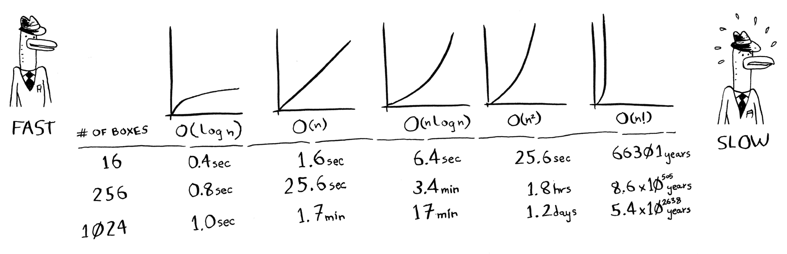

# Summary of Chapter - 1  

- ## Introduction to algorithms

     Before you start :  All the examples in this book are in Python. If you don’t know any programming languages and want to learn one, choose Python—it’s great for beginners.

    - ### Binary Search 
        1. One of the ways to search an element in the list 
        2. Works only when the array is `sorted`
        3. Returns the index of element if found , otherwise returns `null`
        4. In general, for any list of n, binary search will take `log2 n` steps to run in the worst case, whereas simple search will take n steps.
        5. Fastest Avg. search time  possible in an array is `O(logn)`

    - ### Big O notation 
        1. While designing algorithms you need to know how the running time increases as the list size increases. That’s where Big O notation comes in. Big O notation tells you how fast an algorithm is.
        2. Big O notation is about the worst-case scenarios . 
        3. Travelling Salesman has O(n!) time complexity . 🤮 
 
         

