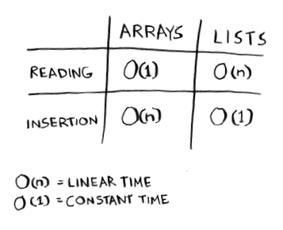

# Summary of Chapter - 2 

- ## How Memory Works 
    1. Each time you want to store an item in memory, you ask the computer for some space, and it gives you an address where you can store your item.
    2. Adding item to an `array` is hard . To resolve this
        -  Ask for extra space 
        - have large chunks of continuous space empty 
    3. Link List solves the folloiwng problems . 
    4. If there’s space in memory, you have space for your linked list. They are good for `inserion` 😱
    5. `Searching` in Link List is Pain in the Ass . Array's are better here . 
  

- ## Arrays & Link List 
    1. The position of an element is called its index
    2. It is a bad idea to use array if you want to insert an element in between an array 
    3. you will have to move and find the right continuous block space to accomodate this 
    4. Deleting an element in arrays is worst 
    5. arrays are faster at reads

     
    

-  # Sorting
    1. Selection sort is brutforce sort 

- # Very Important Conceptually 
    1. `Arrays allow fast reads.`
    2. `Linked lists allow fast inserts and deletes.`

    