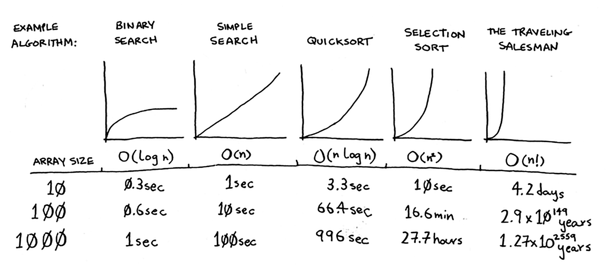

# Summary of Chapter - 3

### Divide & Conquer (D&C)

 - 1. Consider a base case and the recursive case and then build on it. 
 - 2. figure out a simple base case
 - 3. figure out how to reduce the problem to base case 
 - 4. `When you’re writing a recursive function involving an array, the base case is
       often an empty array or an array with one element`

### Quicksort

 - 1. Pick a `Pivot` element from the array
 - 2. Arrange elemets lager than pivot and smaller than pivot 
 - 3. Repeat the process till the end 
 - 4. Quicksort uses D&C algorithm  
 - 5. Recursivly divide the array untill there are two elements in rach array . 
 - 6. `Selection sort` is O(nlogn) always , while quick sort is `O(nlogn)` on average . 
 - 7. Quicksort versus merge sort is one example. Quicksort has a smaller constant than merge sort. So if they’re both O(n log n) time, quicksort is faster. And
 quicksort is faster in practice because it hits the average case way more
 often than the worst case.
 - 8. If you always choose a random element in the array as the
 pivot, quicksort will complete in O(n log n) time on average. Quicksort
 is one of the fastest sorting algorithms out there, and it’s a very good
 example of D&C. 
  

 