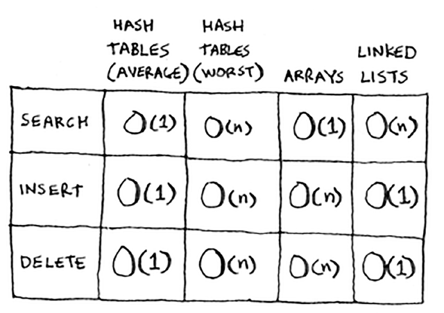
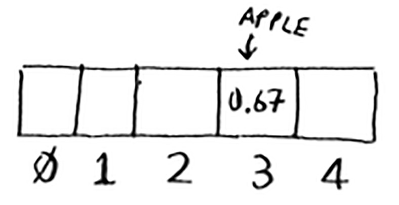

# Summary of Chapter - 5

### Hash Tables

- 1. Used to search items in `o(1)`😱 time 
- 2. we’d say that a hash function “maps strings to numbers.”
- 3. Push the string into the hash function , the hash function will give you an integer 
     store the value corresponding to it on the index 
- 4. Put a hash function and an array together, and you get a data structure called a   hash table.
- 5. They’re also known as hash maps, maps, dictionaries, and associative arrays.
- 6. A hash table has keys and values.
- 7. You can use Python’s hash tables and assume that you’ll get the
     average case performance: constant time. 
     
      